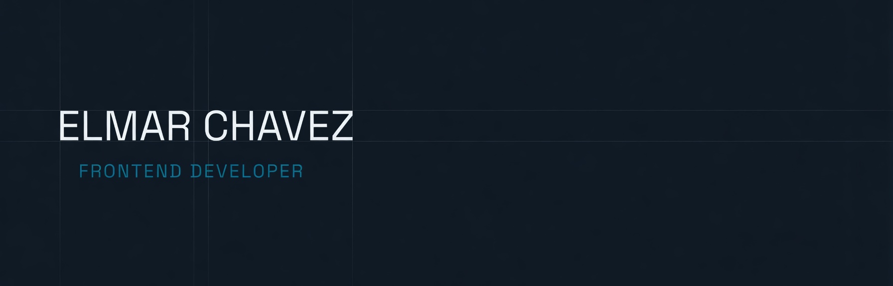

    

# About Me

**Licensed civil engineer** turned **frontend developer** building accessible, responsive web applications. I build **[my projects](https://github.com/CodingWithJiro/Projects)** in public, review code in **[Frontend Mentor](https://www.frontendmentor.io/profile/CodingWithJiro)**, and participate in collaborative projects and open source.

# What I'm Doing Now

Currently, I'm building **[Where In The World w/ REST Countries API](https://github.com/CodingWithJiro/frontend-mentor-where-in-the-world)** using **React + Tailwind CSS + TypeScript**, completing **[freeCodeCamp's full stack developer curriculum](https://www.freecodecamp.org/learn/full-stack-developer-v9/)**, and actively reviewing projects in **[Frontend Mentor](https://www.frontendmentor.io/profile/CodingWithJiro)**.

# Explore My Work

Check out my **[Projects Hub](https://github.com/CodingWithJiro/Projects)** which is a growing collection of all the web applications I’ve built as a frontend developer.

Here are some of my latest projects (🌐 Live Demo · 💻 Source Code):

|                         |               |  |
| :-------------------------------------------------------------------------------------------------------------------------------------------------------------------------------------------------------------------------------: | :------------------------------------------------------------------------------------------------------------------------------------------------------------------------------------------------------------------------------------------------: | :------------------------------------------------------------------------------------------------------------------------------------------------------------------------------------------------------------------------------------------------: |
|                     **TickTock** [🌐](https://ticktock-jiro.netlify.app/) · [💻](https://github.com/CodingWithJiro/wesbos-js-30-clock)   _See your current date and time or search for another location!_                     | **JavaScript Fundamentals** [🌐](https://javascript-fundamentals-jiro.netlify.app/) · [💻](https://github.com/CodingWithJiro/w3schools-js-tutorial-clone-site)   _A technical and interactive documentation W3Schools JS Tutorial clone site!_ |       **Extensions Manager** [🌐](https://browser-extension-fm-jiro.netlify.app/) · [💻](https://github.com/CodingWithJiro/frontend-mentor-browser-extension-manager)   _Filter, remove, and restore your favorite browser extensions!_        |
|  |             |             |
|                  **No One Asked** [🌐](https://no-one-asked-fcc-jiro.netlify.app/) · [💻](https://github.com/CodingWithJiro/freecodecamp-js-no-one-asked)   _Get a random advice, copy it or share it in X!_                  |               **Veil and Visions** [🌐](https://veil-and-visions-fcc-jiro.netlify.app/) · [💻](https://github.com/CodingWithJiro/freecodecamp-js-fortune-teller)   _Draw three cards to reveal your past, present, and future!_                |                     **Base Apparel** [🌐](https://base-apparel-fm-jiro.netlify.app/) · [💻](https://github.com/CodingWithJiro/frontend-mentor-base-apparel-coming-soon)   _Sign-up your email, subscribe to Base Apparel!_                     |

# Tech Stack

**Libraries & Frameworks:** 

**Core Technologies:** 

**Tooling & Testing:** 

**Platforms & Deployment:** 

# GitHub Stats

  
  

# Continuous Learning

I master my craft by following a **[frontend roadmap](https://roadmap.sh/frontend?s=67de4dc78342031660de72cc)**, actively building and reviewing in the **[Frontend Mentor](https://www.frontendmentor.io/profile/CodingWithJiro)** community, solving code challenges and ranking in the top 1% on **[Codewars](https://www.codewars.com/users/CodingWithJiro)**, and staying current with web development trends through **[daily.dev](https://app.daily.dev/elmarchavez)**.

# Connect with Me

You can follow or message me in the following links below or view **[my latest CV here](https://docs.google.com/document/d/1EgAQ13Kd732JbctzxesEL9H9eETYl2Twdtxsou2qc_8/edit?usp=drive_link)**

<!-- 
_Twitter link to be updated_ -->
