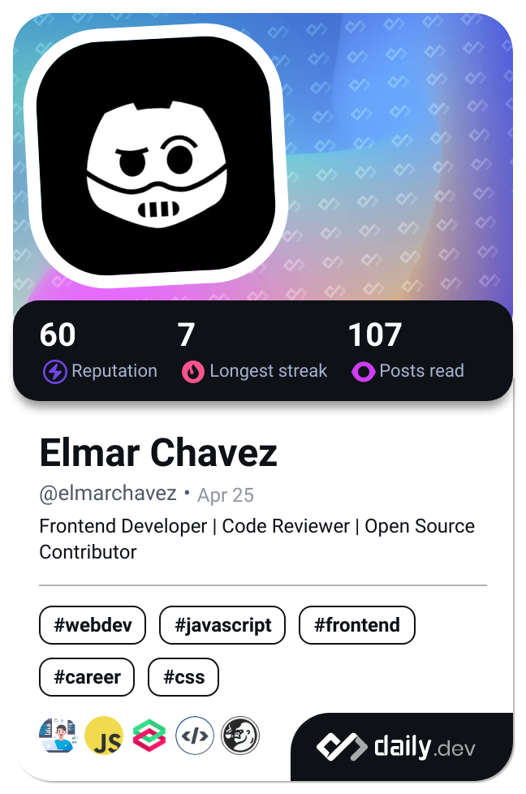

    

# About Me

- A **licensed civil engineer** transitioning into **frontend web development** focused on building accessible, responsive, and user-friendly websites

- I document and share **[every project](https://github.com/CodingWithJiro/Projects)** I build ranging from real-world web apps to interactive educational sites

- **Current goal:** Actively seeking a _frontend developer role_ and open to _freelance work_

- **Long-term goal:** Grow into _full-stack development_, _AI_, _systems design_, and _cloud architecture_

# Explore My Work

Check out my **[Projects Hub](https://github.com/CodingWithJiro/Projects)** which is a growing collection of all the websites, challenges, and mini-apps I’ve built while learning frontend web development.

Here are some of my latest projects (🌐 Live Demo · 💻 Source Code):

|                         |    |     |
| :-------------------------------------------------------------------------------------------------------------------------------------------------------------------------------------------------------------------------------: | :-------------------------------------------------------------------------------------------------------------------------------------------------------------------------------------------------------------------------------------: | :--------------------------------------------------------------------------------------------------------------------------------------------------------------------------------------------------------------------------: |
|                                                        **TickTock**  路                                                          |                                     **JavaScript Fundamentals**  路                                       |                                             **Keyboard Warrior**  路                                              |
|                                                                                           _Search a location's current date and time!_                                                                                            |                                                                              _A technical and interactive documentation W3Schools JS Tutorial clone site!_                                                                              |                                                                             _A fun drum beats app inspired from Wes Bos' #JavaScript30 course!_                                                                              |
|  |  |  |
|                                             **No One Asked**  路                                               |                                           **Veil and Visions**  路                                             |                                               **RainDrop**  路                                                 |
|                                                                                         _Get a random advice, copy it or share it in X!_                                                                                          |                                                                                      _Draw three cards to reveal your past, present, and future!_                                                                                       |                                                                                  _A weather app powered by freeCodeCamp API with a twist!_                                                                                   |

# Tech Stack

# GitHub Stats

  
  

# Learning Progress

I'm actively following this **[frontend developer roadmap](https://roadmap.sh/frontend)** to guide my learning. Since then I have been exposed to multiple relevant documents that helped me where I am today.

## Current Roadmap Progress

## Current Codewars Rank

I solve code challenges daily in **[Codewars](https://www.codewars.com/users/CodingWithJiro)** to further level up and polish my programming skills!

## Current Reading Statistics

Finally, I follow the latest tech trends and web development in **[daily.dev](https://daily.dev/)**. I read an article or two that interests me whenever I need a breather from actual coding.

# Connect with Me

You can follow or message me in the following links for future collaborations!

_Twitter link to be updated_

# Support My Journey

If my GitHub helped you in some way, consider supporting me:

_Links to be updated_
