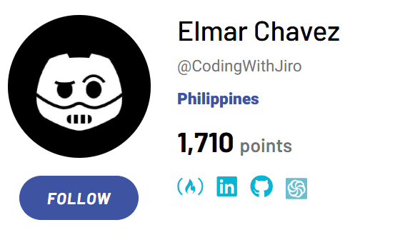

    

# About Me

- **Licensed civil engineer** turned **frontend developer** focused on building accessible, responsive, and user-centered web apps

- I document and share **[every project](https://github.com/CodingWithJiro/Projects)** I build ranging from real-world web apps to interactive educational sites

- Active in **Frontend Mentor** developer community, where I regularly review code and exchange feedback with other developers

- Recently began contributing to **open-source projects**, expanding my collaborative and problem-solving skills

- **Current goal:** Actively seeking a _frontend developer role_ and open to _freelance work_

- **Long-term goal:** Grow into _full-stack development_, _AI_, _systems design_, and _cloud architecture_

# What I'm Doing Now

Focused on sharpening my JavaScript fundamentals through **[javascript.info](https://javascript.info/)** and leveling up with **[React](https://react.dev/)**. I'm applying everything I learn by building small, real-world projects to strengthen my skills.

# Explore My Work

Check out my **[Projects Hub](https://github.com/CodingWithJiro/Projects)** which is a growing collection of all the websites, challenges, and mini-apps I’ve built while learning frontend web development.

Here are some of my latest projects (🌐 Live Demo · 💻 Source Code):

|                         |               |                |
| :-------------------------------------------------------------------------------------------------------------------------------------------------------------------------------------------------------------------------------: | :------------------------------------------------------------------------------------------------------------------------------------------------------------------------------------------------------------------------------------------------: | :-------------------------------------------------------------------------------------------------------------------------------------------------------------------------------------------------------------------------------------: |
|                     **TickTock**  路    _See your current date and time or search for another location!_                     | **JavaScript Fundamentals**  路    _A technical and interactive documentation W3Schools JS Tutorial clone site!_ |             **Keyboard Warrior**  路    _A fun drum beats app inspired from Wes Bos' #JavaScript30 course!_              |
|  |             |  |
|                  **No One Asked**  路    _Get a random advice, copy it or share it in X!_                  |               **Veil and Visions**  路    _Draw three cards to reveal your past, present, and future!_                |          **Newsletter Sign-Up Form**  路    _Sign-up your email, subscribe to a newsletter!_           |

# Tech Stack

## Core Technologies

## Libraries and Framewoks

## Tools and Platforms

# GitHub Stats

  
  

# Learning Progress

The following are the steps I follow in learning frontend development:

## Current Roadmap Progress

I'm actively following this **[frontend developer roadmap](https://roadmap.sh/frontend?s=67de4dc78342031660de72cc)** to structure my learning journey. You can track my progress across its sub-roadmaps, including **[JavaScript](https://roadmap.sh/javascript?s=67de4dc78342031660de72cc)**, **[Git & GitHub](https://roadmap.sh/git-github?s=67de4dc78342031660de72cc)**, and **[React](https://roadmap.sh/react?s=67de4dc78342031660de72cc)**:

## Current Frontend Mentor Points

I committed to actively engaging with the **[Frontend Mentor](https://www.frontendmentor.io/profile/CodingWithJiro)** community by giving occasional feedback to other developers and creating real-world projects based on their challenges.

## Current Codewars Rank

I solve code challenges daily in **[Codewars](https://www.codewars.com/users/CodingWithJiro)** and **[freeCodeCamp](https://www.freecodecamp.org/learn/daily-coding-challenge/archive)** to further level up and polish my programming skills. Currently I am in the **top 1%** in CodeWars.

## Current Reading Statistics

Finally, I follow the latest tech trends and web development in **[daily.dev](https://daily.dev/)**. I read an article or two that interests me whenever I need a breather from actual coding.

# Connect with Me

You can follow or message me in the following links below or view **[my latest CV here](https://docs.google.com/document/d/1EgAQ13Kd732JbctzxesEL9H9eETYl2Twdtxsou2qc_8/edit?usp=drive_link)**

_Twitter link to be updated_

<!-- # Support My Journey

If my GitHub helped you in some way, consider supporting me:

_Links to be updated_ -->
